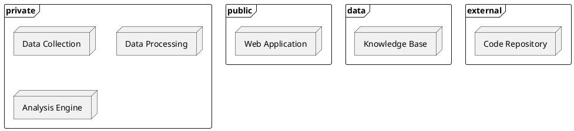

# 최종 Deployment Diagram 초안 가이드

## 목적

앞선 산출물을 모두 흡수해 실제 다이어그램 초안을 만드는 방법을 설명한다.

## 권장 문서 형태

- 한 줄 목적
- 다이어그램 소스
- 범례
- 오픈 이슈

## 필수 항목

- 상위 경계
- Node
- Artifact
- 연결
- 연결 표기 기준
- 미확정 사항

## 연결 표기 원칙

- 외부 시스템과의 연결은 프로토콜 중심으로 표기
- `Knowledge Base`와의 연결은 접근 방식 중심으로 표기
- 최종 다이어그램의 연결 라벨은 `04-communication` 산출물과 같은 이름을 사용

## 예시 형태

````md
# 최종 Deployment Diagram 초안

## 목적
- TCI 서비스가 어디서 제공되는지 설명

## 다이어그램 소스


## 오픈 이슈
- Knowledge Base 내부 세부 저장 계층을 메인 그림에 드러낼지 보조 설명으로 둘지 추가 확인
````

## 완료 기준

- 앞선 산출물과 이름이 충돌하지 않는다
- 경계, Node, Artifact, 연결이 모두 들어간다
- 오픈 이슈가 따로 분리돼 있다
